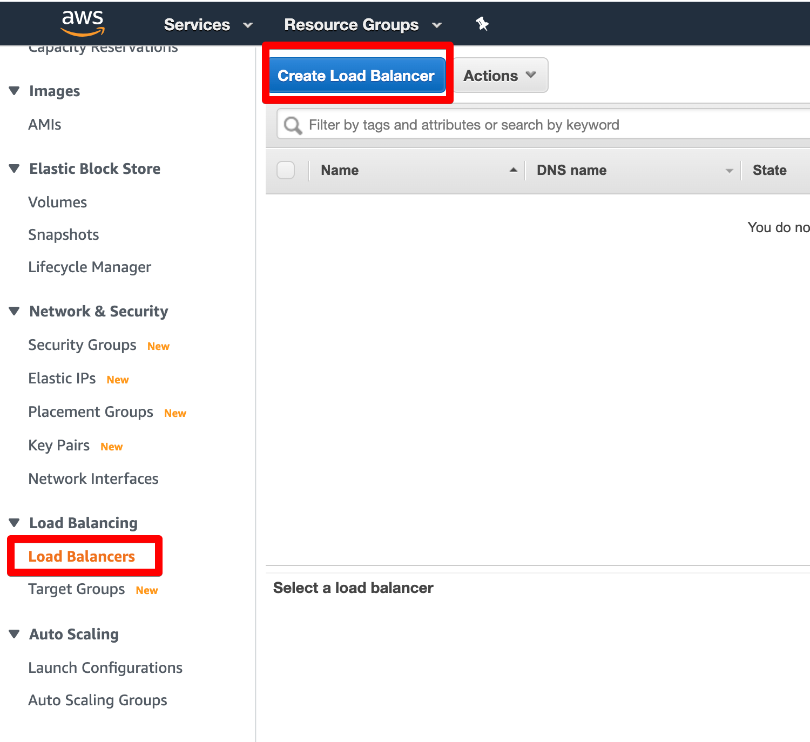
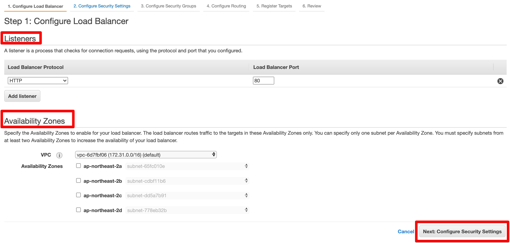
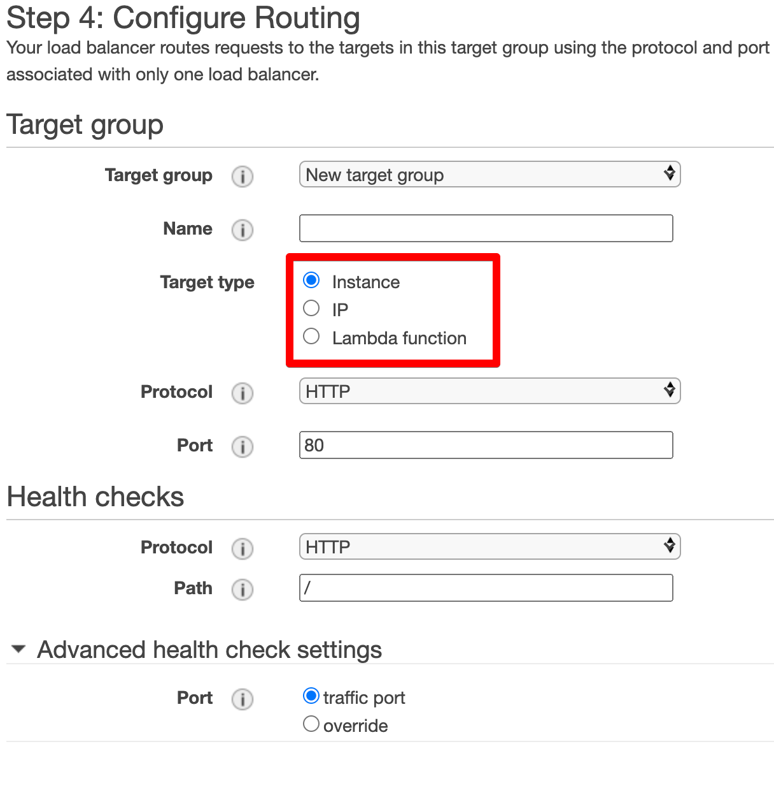
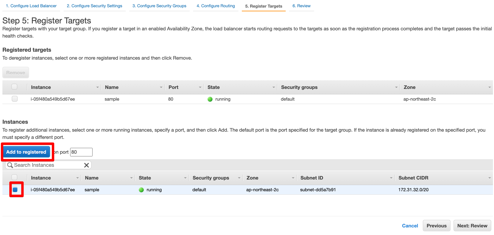
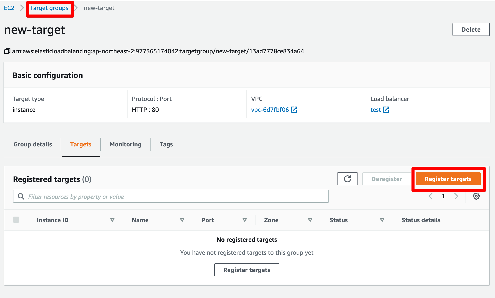

1. Create Load Balancer at EC2 Console.

    

1. Configure Load Balancer. In this page, you can also specify the AZ(Availability Zones).

    * (Caution!) If your load balancer Availability Zone is not includes your EC2 instance's AZ, it will not work correctly.

    

1. Configure Security Groups

1. Configure Routing. You can specify Target Group.

    

1. Register Targets

    

    * If you don't have instance yet, follow the steps below.
        1. Click `Next: Review` button and create.
        1. Create EC2 instance.
        1. Click `Load Balancing - Target Groups` at EC2 Console navigation.
        1. Click created target.
        1. Click `Register targets`.

            

    
    
    
    
    

? 80포트 안열여도 되는지? 또는 둘 다 열어야 하는지?
? 80서버 오픈해야 헬스체크가 되는지?

